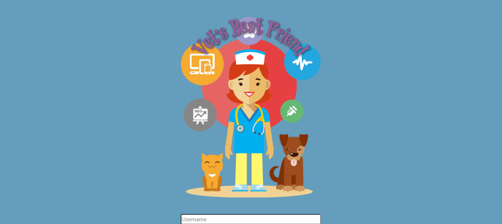
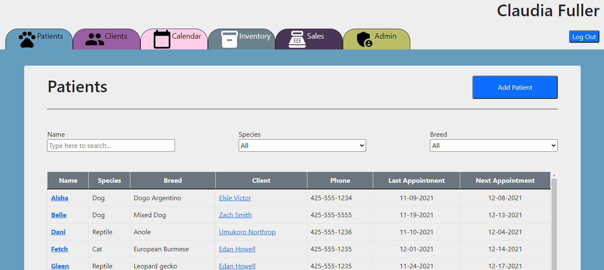
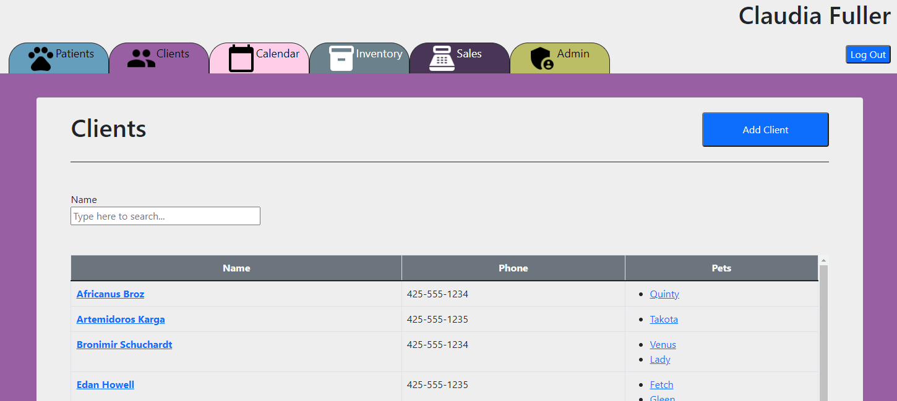

# Vet's Best Friend (VBF) - Back End

## Description
This it the back end for a vet management app. The site allows users to track their clients, patients, appointments, and inventory.  
  
The URL for the front end of the site can be found below.
## Table of Contents
- [Installation](#installation)
- [Usage](#usage)
- [Credits](#credits)
- [License](#license)
## Installation
Required Dependencies:
- bcrypt
- compression
- connect-session-sequelize
- cors
- dotenv
- express
- express-session
- jsonwebtoken
- mysql2
- sequelize
## Usage
Front End Site - [Vet's Best Friend](https://vetbestfriend.herokuapp.com/)
- Admin User:  
    - Username: cadmin  
    - Password: password  
- User:
    - Username: cuser
    - Password: password
  
Back End Site [Vet's Best Friend API](https://vetbestfriend-back.herokuapp.com/)  
Front End GitHub [Vet's Best Friend API - GitHub](https://github.com/Lemelisk27/vbf-front)  
Back End GitHub [Vet's Best Friend API - GitHub](https://github.com/Lemelisk27/vbf-back)
  

  
  
## Credits
Zach Smith - [GitHub Profile](https://github.com/Lemelisk27@gmail.com)  
## License
This Product is licensed under the MIT license.  
For more information please visit: https://spdx.org/licenses/MIT.html
## Questions  
If you have any questions you can contact me directly at Lemelisk27@gmail.com. You can also find more of my work on GitHub at [Lemelisk27](https://github.com/Lemelisk27) or you can view my portfolio [here](https://lemelisk27.herokuapp.com/).